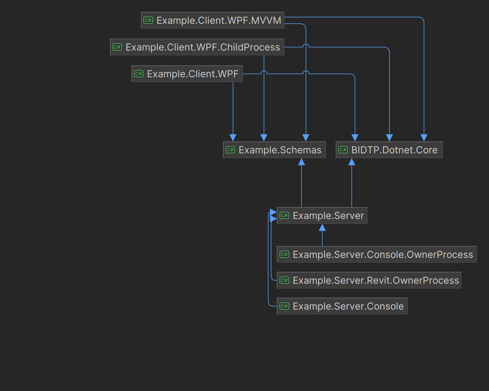
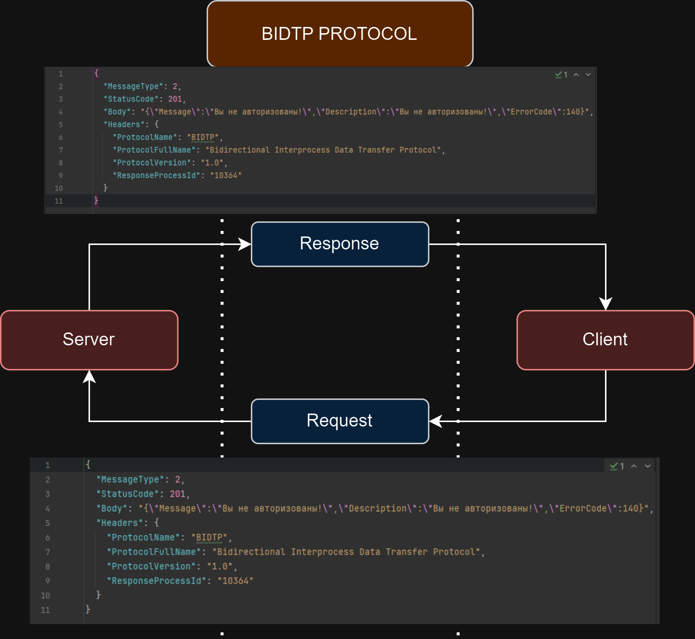

# Preface

Bidirectional Interprocess Data Transfer Protocol (BIDTP) - a simple-to-use data exchange protocol between two processes.

<br />
<div align="center">
    
</div>

# Questions and answers

### Ask:

-   Why should I split my application into client and server?

### Answer:

-   Separate testing and debugging of applications. It's easier to abstract yourself
-   Independence from stack and technologies
-   Separate process, domain for each application. If your application works as a plugin, then this solves the problem of dependency conflicts (Addin Autodesk Revit)
-   Separation of areas of responsibility for application development - if it is developed in a team

### Ask:

-   Why should I use this protocol if I can use web protocols?

### Answer:

-   This protocol is intended for local tasks of interaction between two processes. If you use web protocols for such tasks, you may encounter unexpected problems on the client side. For example - the client’s port is closed or there is a problem with the network

### Ask:

-   It's too complicated, I'll have to write a lot of code to interact with the business logic. It's easier to call a service or method directly within one process

### Answer:

-   The protocol is provided with the entire infrastructure with features that allow not only to minimize the cost of writing code for interaction, but also provide general functionality - necessary for creating modern applications - on the client and server sides

# Philosophy and goals

The main issues addressed by this protocol include facilitating simple interaction between two processes. This enables independent and implicit communication between applications, regardless of the technologies used in their development.

The same effect can be achieved by using web protocols such as WebSocket, TCP, UDP, HTTP, and others. However, their obvious downside is that for their correct operation, it is necessary to ensure that the required ports are open on the local machine of the client or server and there are no issues with the network infrastructure.

In the current approach, data exchange between processes occurs at a lower level (byte-to-byte).

I express my deep gratitude to Nice3point (Roman), particularly for his article on process communication:
https://github.com/Nice3point/InterprocessCommunication

# Structure of BIDTP protocol

Below are listed the main components along with their general descriptions.

## Interaction scheme

<br />
<div align="center">
    
</div>

The BIDTP protocol is based on client-server interaction. Communication between the components occurs using messages in a byte stream (pipe stream). The messages consist of Request\Response objects.

## Requirements of data types

Below are listed the main data types:

| Data type      | Size (bytes) |
| -------------- | ------------ |
| int (32 bit)   | 4            |
| char (unicode) | 2            |

## Requirements to request

The request object has the following structure:

| Field name     | Type             | Size (bytes) |
| -------------- | ---------------- | ------------ |
| MessageLength  | int              | 4            |
| MessageType    | enum (int )      | 4            |
| HeadersLength  | int              | 4            |
| HeadersContent | string (unicode) | var          |
| BodyLength     | int              | 4            |
| BodyContent    | string (unicode) | var          |

## Requirements to response

The response object has the following structure:

| Field name     | Type             | Size (bytes) |
| -------------- | ---------------- | ------------ |
| MessageLength  | int              | 4            |
| MessageType    | enum (int )      | 4            |
| StatusCode     | enum (int )      | 4            |
| HeadersLength  | int              | 4            |
| HeadersContent | string (unicode) | var          |
| BodyLength     | int              | 4            |
| BodyContent    | string (unicode) | var          |

## Status code

The status code is a specific code (classification) of responses from the server according to this protocol. The main status codes and their descriptions are provided below:

| Code         | Description                                                       |
| ------------ | ----------------------------------------------------------------- |
| Success      | 100 - Successful response from the server                         |
| ClientError  | 200 - Not successful Server response - error on client side       |
| Unauthorized | 201 - Not successful Server response - client is not unauthorized |
| NotFound     | 202 - Not successful Server response - route not found            |
| ServerError  | 300 - Not successful Server response - error on server side       |

# Server connection

The main task of implementing the server was to create the fundamental infrastructure for easy server management and handling of its dependencies.

It was also important to provide developers with the freedom to implement business tasks for applications, ranging from creating their own authentication/authorization schemes to data exchange schemas.

Setting up and connecting a server using the BIDTP protocol is very simple!

```c#
# Create builder
var builder = new ServerBuilder();

# Create and set generic options
var options = new ServerOptions("testpipe", 1024,  5000);
builder.SetGeneralOptions(options);

# U can use any DI container
var serviceCollection = new ServiceCollection();

# Add providers in DI container
builder.ServiceCollection.AddLogging(l => l.AddConsole().SetMinimumLevel(LogLevel.Information));

var serviceProvider = serviceCollection.BuildServiceProvider();

# Add custom DI container
builder.AddDiContainer(serviceProvider);

# Add route and handle this
builder.AddRoute("route", HandleThisRoute);

# Build it!
var server = builder.Build();
```

## DI container

The server has a DI (Dependency Injection) container for convenient use of providers and services. You can connect your providers to the container:

```c#
# Your logger provider
builder.ServiceCollection.AddLogging(l => l.AddConsole().SetMinimumLevel(LogLevel.Information));

# Your AuthProvider
builder.ServiceCollection.AddTransient<AuthProvider>();

# Your ColorProvider
builder.ServiceCollection.AddScoped<ColorProvider>();

# Your Repository
builder.ServiceCollection.AddSingleton<ElementRepository>();

```

U can use ur custom DI container, implemet IServiceProvider and do it!

## Flexible routing system

The server also features a flexible routing system. You can create chains of handlers to process different routes, which will be executed sequentially:

```c#
# Add for "PrintMessage" route many handlers\middlewares\guards
builder.AddRoute("PrintMessage", JustChickenGuard, MessageController.PrintMessageHandler);

# Add for "GetElements" route controller method
builder.AddRoute("GetElements", MessageController.GetElements);

# Local handler or middleware or guard
Task JustChickenGuard(Context context)
{
    var request = context.Request;

    var isShitWord = request.Body.Contains("Yes of course");

    if(isShitWord)
    {
        var dto = new Error
        {
            Message = "I am Alexandr Nevsky",
            Description = "Exception: Chicken-Bodybuilder detected",
            ErrorCode = 228
        };

        var response = new Response(StatusCode.ClientError)
        {
            Body = JsonConvert.SerializeObject(dto)
        };

        context.Response = response;
    }

    return Task.CompletedTask;
}
```

Exactly - you can use your custom middleware\guards to effectively manage the lifecycle of messages, providing flexibility and efficiency. All you need to do is utilize the Context as a parameter in your method.

## Background services

If you need the server to utilize the functionality of background services (workers) that will operate asynchronously, you can make use of adding custom components and connect them to the server:

```c#
# Set custom name for services
server.AddBackgroundService<LoggingWorker>("BackgroundWorker1");
server.AddBackgroundService<LoggingWorker>("BackgroundWorker2");

or

# Or leave it to the server
server.AddBackgroundService<LoggingWorker>();
```

## Write\read events

You can use your data transfer events (write and read) to use this information to more accurately display progress of server:

```c#
# Read event
App.Server.ReadProgress += OnProgress;

# Write event
App.Server.WriteProgress += OnProgress;

# Handle!
private void OnProgress(object? sender, ProgressEventArgs e)
{
    var bytesWritten = e.BytesWritten;
    var totalBytes = e.TotalBytes;
    var progressPercentage = (int)((double)bytesWritten / totalBytes * 100);

    if (totalBytes == bytesWritten)
    {
        Console.WriteLine("Completed");
    }
    else if (progressPercentage >= 0 && progressPercentage <= 100)
    {
        var message = $"{e.ProgressOperationType.ToString()} progress: {progressPercentage}%";
        Console.WriteLine(message);
    }
}
```

# Client connection

For connecting a client to the server, you need to create a settings class, instantiate a PIDERS client, and establish a connection to the server:

```c#
# Simple WPF app
public partial class App
{
    # Or set in DI\Singleton\other place
    public static Client? Client;

    protected override void OnStartup(StartupEventArgs e)
    {
        # Create options
        var options = new ClientOptions("testpipe",
            1024, 9000,
            1000, 5000);

        # Create client
        Client = new Client(options);
    }
}
```

For sending messages, you can create a class (Request) and send it, then wait to receive a response from it (Response):

```c#
# Use it anywhere
private async void SendMessageButton_OnClick(object sender, RoutedEventArgs e)
{
    try
    {
        var mainWindow = (MainWindow)Application.Current.MainWindow;

        # Create request
        var request = new Request
        {
            Body = MessageInputTextBox.Text,
            Headers = new Dictionary<string, string>()
        };

        var token = mainWindow.AuthTokenTextBox.Text;

        # Set custom header
        request.Headers.Add("Authorization", token);

        # Set route
        request.SetRoute("PrintMessage");

        # Set response
        var response = await App.Client.WriteRequestAsync(request);

        var formattedResponseText = JToken.Parse(response.Body)
            .ToString(Newtonsoft.Json.Formatting.Indented);

        OutPutTextBlock.Text = formattedResponseText;

        MessageBox.Show(formattedResponseText);
    }
    catch (Exception exception)
    {
        MessageBox.Show(exception.Message);
    }
}


```

## Write\read events

You can use your data transfer events (write and read) to use this information to more accurately display progress of client:

```c#
# Read event
App.Client.ReadProgress += OnProgress;

# Write event
App.Client.WriteProgress += OnProgress;

# Handle it!
private async void OnProgress(object? sender, ProgressEventArgs e)
{
    await Dispatcher.InvokeAsync(() =>
    {
        var bytesWritten = e.BytesWritten;
        var totalBytes = e.TotalBytes;
        var progressPercentage = (int)((double)bytesWritten / totalBytes * 100);

        if (totalBytes == bytesWritten)
        {
            ProgressBarTextBlock.Text = "Completed";
            ProgressBar.Value = 0;
        }
        else if (progressPercentage >= 0 && progressPercentage <= 100)
        {
            var message = $"{e.ProgressOperationType.ToString()} progress: {progressPercentage}%";

            Debug.WriteLine(message);

            ProgressBarTextBlock.Text = message;
            ProgressBar.Value = progressPercentage;
        }
    });
}
```

## Health-checking

The client implements logic for checking the connection to the server - to obtain more up-to-date information about its status:

```c#
App.Client.IsLifeCheckConnectedChanged += (s, e) =>
{
    Dispatcher.InvokeAsync(() =>
    {
        if (e)
        {
            EllipseStatusCircle.Fill = Brushes.Green;
            ConnectToServerButton.Content = "Disconnect";
            ServerStatusTextBlock.Text = "Server connected";
        }
        else
        {
            EllipseStatusCircle.Fill = Brushes.Red;
            ConnectToServerButton.Content = "Connect";
            ServerStatusTextBlock.Text = "Server not connected";

        }
    });
};

# Can u connect or not?
var canConnect = App.Client.IsConnectionStarting;

# U connected?
var isConnected = App.Client.IsHealthCheckConnected;

```

# Examples

In the repository, there are examples of .NET applications:

1. Example.Client.WPF - A reconnectable client application based on the .NET Core 6 framework.
2. Example.Client.WPF.MVVM - A reconnectable client application based on the .NET Core 6 framework with MVVM
3. Example.Client.WPF.ChildProcess - A client application based on the .NET Core 6 framework. It needs to be run by the server (owner process).
4. Example.Server.Console - A server application based on the .NET Framework 4.8, presented as a console application.
5. Example.Server.Console.OwnerProcess - A server application based on the .NET Framework 4.8, which runs another client-child process.
6. Example.Server.Revit.OwnerProcess - A server application based on the .NET Framework 4.8 and Revit API, also running another client-child process.
7. Example.Schemas - Declaration of generic DTO schemas for client-server communication.
